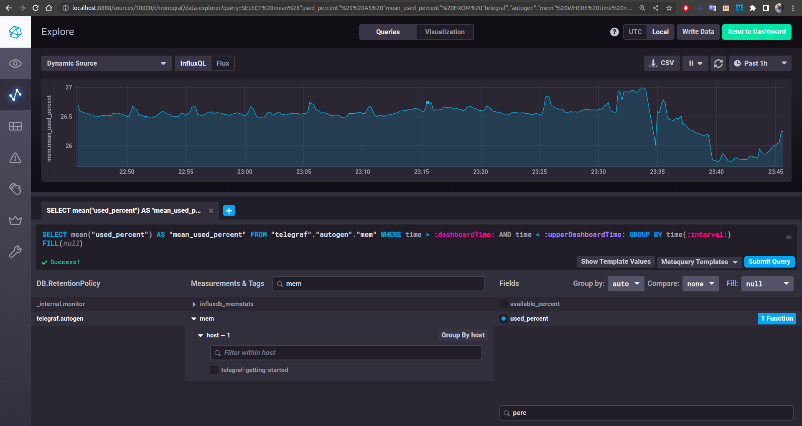

# Домашнее задание к занятию "10.02. Системы мониторинга"

## Обязательные задания

**1. Опишите основные плюсы и минусы pull и push систем мониторинга.**

### Ответ:
```
Плюсы push:
1. может использоваться несколько серверов, на которые будут отправляться данные мониторинга (репликация)
2. гибкость настройки отправки данных с метриками
3. использование UDP может повысить производительность сбора метрик
Минусы push:
1. существует возможность отправки данных мониторинга с "чужой" машины
2. нет шифрования соединения
3. риск потери данных мониторинга, т.к. протокол UDP не гарантирует доставку данных

Плюсы pull:
1. контроль подлинности данных за счёт опроса только тех машин, которые прописаны в системе мониторинга
2. есть возможность использования шифрованных каналов между системой мониторинга и агентами
3. гибкость отладки получения данных мониторинга за счёт опроса агентов извне системы мониторинга
4. сохранение данных мониторинга на время потери сетевого соединения между агентом и системой мониторинга
Минусы pull:
1. необходимость дополнительной настройки/добавления новых агентов в системе мониторинга при появлении новой машины
```

**2. Какие из ниже перечисленных систем относятся к push модели, а какие к pull? А может есть гибридные?**

    - Prometheus 
    - TICK
    - Zabbix
    - VictoriaMetrics
    - Nagios

### Ответ:
```
1. Prometheus - pull (но может быть push за счёт push gateway)
2. TICK - push
3. Zabbix - гибрид
4. VictoriaMetrics - pull
5. Nagios - push
```

**3. Запуск TICK-стэка**

**3.1 Запущен стэк TICK**
```
baloo@pc:~/devops/10.2-monitoring-systems$ docker-compose ps
NAME                                     COMMAND                  SERVICE             STATUS              PORTS
102-monitoring-systems-chronograf-1      "/entrypoint.sh chro…"   chronograf          running             0.0.0.0:8888->8888/tcp, :::8888->8888/tcp
102-monitoring-systems-documentation-1   "/documentation/docu…"   documentation       running             0.0.0.0:3010->3000/tcp, :::3010->3000/tcp
102-monitoring-systems-influxdb-1        "/entrypoint.sh infl…"   influxdb            running             0.0.0.0:8082->8082/tcp, 0.0.0.0:8086->8086/tcp, 0.0.0.0:8089->8089/udp, :::8082->8082/tcp, :::8086->8086/tcp, :::8089->8089/udp
102-monitoring-systems-kapacitor-1       "/entrypoint.sh kapa…"   kapacitor           running             0.0.0.0:9092->9092/tcp, :::9092->9092/tcp
102-monitoring-systems-telegraf-1        "/entrypoint.sh tele…"   telegraf            running             8125/udp
```

**3.2 Проверка**  
`curl -i http://localhost:8086/ping`
```
baloo@pc:~/devops/10.2-monitoring-systems$ curl -i http://localhost:8086/ping
HTTP/1.1 204 No Content
Content-Type: application/json
Request-Id: 7d569bf5-8c79-11ed-a301-0242ac170003
X-Influxdb-Build: OSS
X-Influxdb-Version: 1.8.10
X-Request-Id: 7d569bf5-8c79-11ed-a301-0242ac170003
Date: Wed, 04 Jan 2023 21:48:14 GMT
```


`curl -i http://localhost:8888` 
```
baloo@pc:~/devops/10.2-monitoring-systems$ curl -i http://localhost:8888
HTTP/1.1 200 OK
Accept-Ranges: bytes
Cache-Control: public, max-age=3600
Content-Length: 414
Content-Security-Policy: script-src 'self'; object-src 'self'
Content-Type: text/html; charset=utf-8
Etag: ubyGAbz3Tc69bqd3w45d4WQtqoI=
Vary: Accept-Encoding
X-Chronograf-Version: 1.10.0
X-Content-Type-Options: nosniff
X-Frame-Options: SAMEORIGIN
X-Xss-Protection: 1; mode=block
Date: Wed, 04 Jan 2023 21:49:04 GMT

<!DOCTYPE html><html><head><link rel="stylesheet" href="/index.c708214f.css"><meta http-equiv="Content-type" content="text/html; charset=utf-8"><title>Chronograf</title><link rel="icon shortcut" href="/favicon.70d63073.ico"></head><body> <div id="react-root" data-basepath=""></div> <script type="module" src="/index.e81b88ee.js"></script><script src="/index.a6955a67.js" nomodule="" defer></script> </body></html>
```
[Скриншот](./files/chronograf.png "chronograf.png") веб-интерфейса ПО chronograf (`http://localhost:8888`)
  


`curl -i http://localhost:9092/kapacitor/v1/ping`
```
baloo@pc:~/devops/10.2-monitoring-systems$ curl -i http://localhost:9092/kapacitor/v1/ping
HTTP/1.1 204 No Content
Content-Type: application/json; charset=utf-8
Request-Id: c208530d-8c79-11ed-a51c-0242ac170004
X-Kapacitor-Version: 1.6.5
Date: Wed, 04 Jan 2023 21:50:09 GMT
```

**4. Добавление плагинов `disk` и `mem` в Telegraf**

В конфигурационный файл *telegraf/telegraf.conf* добавил следующие строки:
```
[[inputs.mem]]
[[inputs.disk]]
  ignore_fs = ["tmpfs", "devtmpfs", "devfs", "iso9660", "overlay", "aufs", "squashfs"]
```

- Перезапустил контейнер с *telegraf* командой `docker restart 102-monitoring-systems-telegraf-1`.
- Перешёл в веб-интерфейс *Chronograf* (`http://localhost:8888`), открыл вкладку *Explore*.
- Нажал кнопку *Add a Query*
- В DB.RetentionPolicy выбрал *telegraf.autogen*
- В *Measurments & Tags* выбрал *mem->host-1->telegraf-getting-started*, в *Fields* выбрал *used_percent*.   


График утилизации оперативной памяти в контейнере telegraf представлен на [скриншоте](./files/telegraf_mem.png "mem.png")


[Cкриншот](./files/telegraf_disk.png "disk.png") с отображением метрик утилизации места на диске *disk->host-1->telegraf-getting-started* из веб-интерфейса.  


**5. Добавление в конфигурацию *telegraf* плагина *docker*:**

В скачанной мной версии *sandbox* в конфиге [telegraf.conf](./files/telegraf.conf "telegraf.conf") уже включён плагин *docker*.  
Часть конфига *telegraf.conf* касающаяся *docker*:
```
[[inputs.docker]]
  endpoint = "unix:///var/run/docker.sock"
  container_names = []
  timeout = "5s"
  perdevice = true
  total = false
```

В конфиге [docker-compose.yml](./files/docker-compose.yml "docker-compose.yml") в блоке касающемся *telegraf* есть следующее:
```
  telegraf:
    # Full tag list: https://hub.docker.com/r/library/telegraf/tags/
    build:
      context: ./images/telegraf/
      dockerfile: ./${TYPE}/Dockerfile
      args:
        TELEGRAF_TAG: ${TELEGRAF_TAG}
    image: "telegraf"
    environment:
      HOSTNAME: "telegraf-getting-started"
    # Telegraf requires network access to InfluxDB
    links:
      - influxdb
    volumes:
      # Mount for telegraf configuration
      - ./telegraf/:/etc/telegraf/
      # Mount for Docker API access
      - /var/run/docker.sock:/var/run/docker.sock
    depends_on:
      - influxdb
```
      
При запуске *sandbox* командой `./sandbox up` с настройками указанными выше метрик мониторинга *docker* не появляется.    
    
Оказалось, что необходимо ещё добавить для остальных пользователей права на чтение и запись файлу */var/run/docker.sock*   
   
```
baloo@pc:~/devops/sandbox$ ll /var/run/docker.sock 
srw-rw---- 1 root docker 0 янв  4 15:39 /var/run/docker.sock=
baloo@pc:~/devops/sandbox$ sudo chmod o+rw /var/run/docker.sock 
[sudo] password for baloo: 
baloo@pc:~/devops/sandbox$ ll /var/run/docker.sock 
srw-rw-rw- 1 root docker 0 янв  4 15:39 /var/run/docker.sock=
```
  
[Заработало](./files/docker-metrics.png):    


