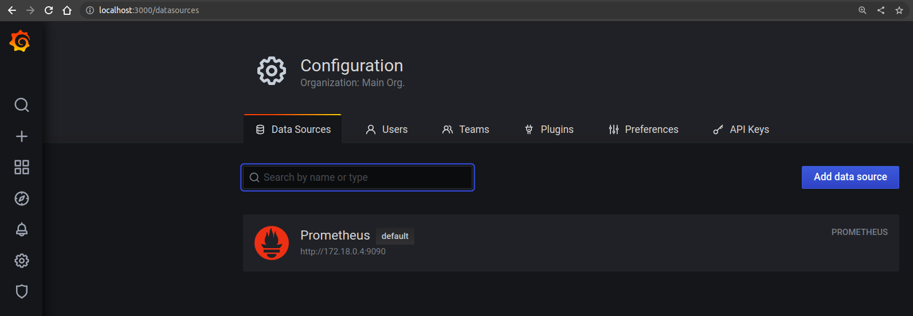
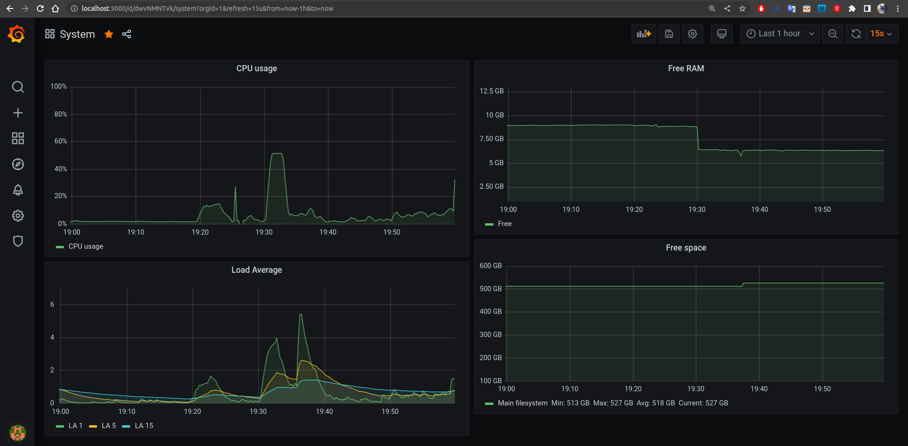
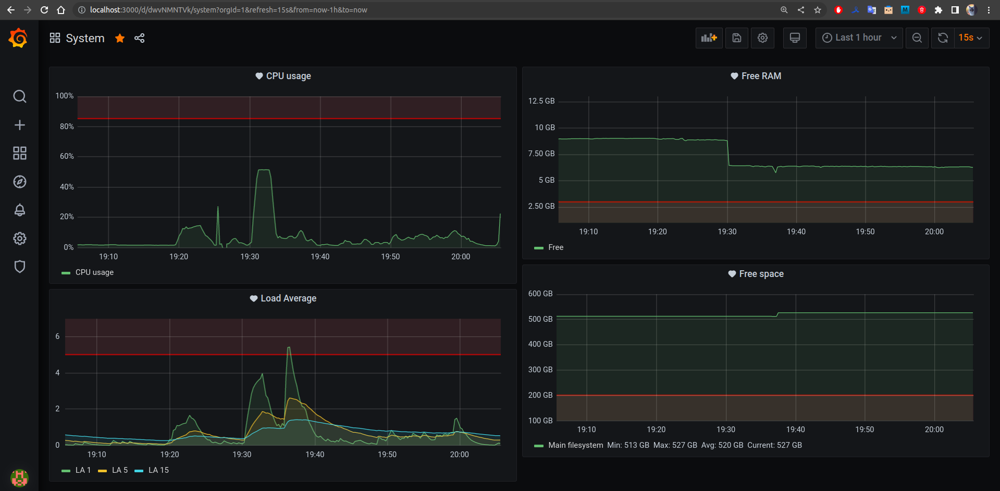

# Домашнее задание к занятию "10.03. Grafana"

## Обязательные задания

## Задание 1
Используя директорию [help](./help) запустил связку *Prometheus-Grafana*.
```
# docker ps
CONTAINER ID   IMAGE                       COMMAND                  CREATED          STATUS          PORTS                                       NAMES
8a0be79c7fdb   grafana/grafana:7.4.0       "/run.sh"                11 minutes ago   Up 11 minutes   0.0.0.0:3000->3000/tcp, :::3000->3000/tcp   grafana
12f34480cf29   prom/prometheus:v2.24.1     "/bin/prometheus --c…"   11 minutes ago   Up 11 minutes   9090/tcp                                    prometheus
4d4924905a97   prom/node-exporter:v1.0.1   "/bin/node_exporter …"   11 minutes ago   Up 11 minutes   9100/tcp                                    nodeexporter
```

Подключил *Prometheus* как источник данных.   
IP-адрес *Prometheus* узнал из `docker network inspect help_monitor-net`.  
 
[Cкриншот](./files/grafana.png "Grafana") веб-интерфейса *grafana* со списком подключенных *Datasource*.


## Задание 2
Создайте *Dashboard* и в ней создайте следующие *Panels*:
1) [Утилизация CPU для nodeexporter (в процентах, 100-idle)](./files/cpu.png)  
**Запрос PromQL:** `100 - (avg by (instance) (rate(node_cpu_seconds_total{job="nodeexporter",mode="idle"}[1m])) * 100)`  

2) [CPULA 1/5/15](./files/la.png)  
**Запрос PromQL:** `node_load1`, `node_load5`, `node_load15`  

3) [Количество свободной оперативной памяти](./files/ram.png)  
**Запрос PromQL:** `node_memory_MemFree_bytes / 1024 / 1024 / 1024`  

4) [Количество места на файловой системе](./files/fs.png)  
**Запрос PromQL:** `node_filesystem_avail_bytes{device="/dev/nvme0n1p5"} / 1024 / 1024 / 1024`  

[Скриншот](./files/db.png) Dashboard:
  

## Задание 3
Создайте для каждой Dashboard подходящее правило alert (можно обратиться к первой лекции в блоке "Мониторинг").

[Скриншот](./files/db-alerts.png) итоговой Dashboard:  
  

## Задание 4
[Содержимое *JSON Model*](./files/json-model.json)  
