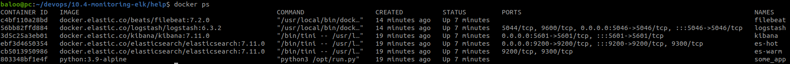
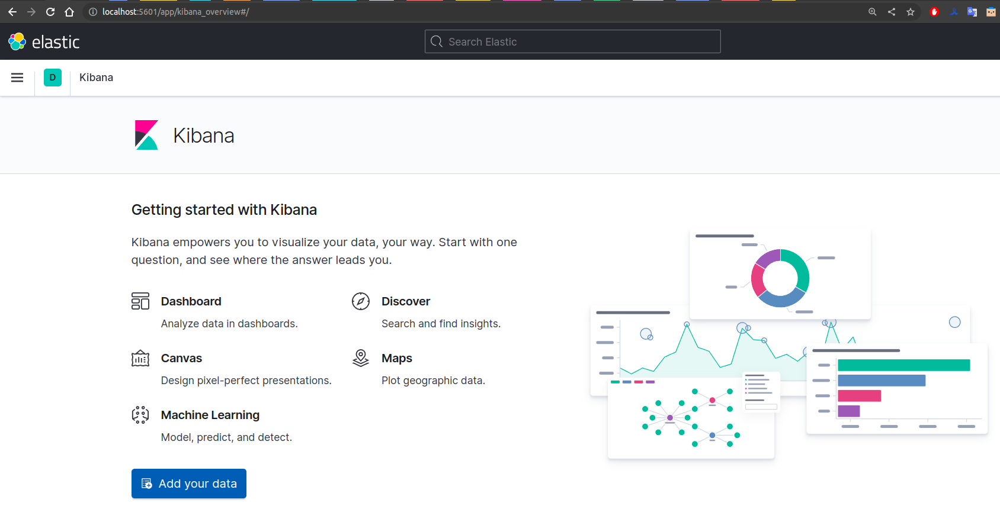
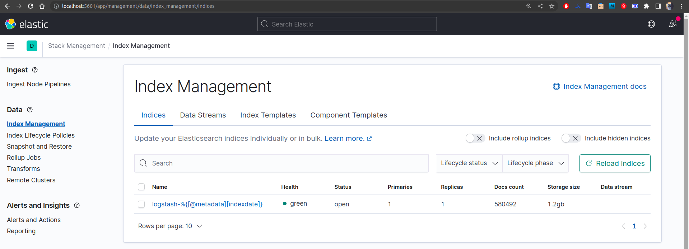
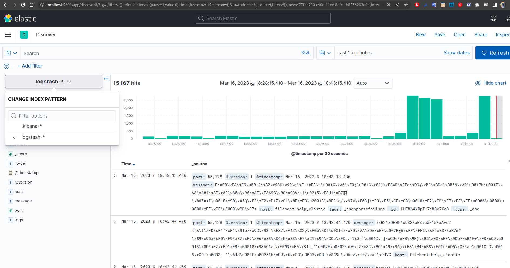

# Домашнее задание к занятию "10.04. ELK"

## Задание 1

Вам необходимо поднять в докере:
- elasticsearch(hot и warm ноды)
- logstash
- kibana
- filebeat

и связать их между собой.

Logstash следует сконфигурировать для приёма по tcp json сообщений.

Filebeat следует сконфигурировать для отправки логов docker вашей системы в logstash.

В директории [help](./help) находится манифест docker-compose и конфигурации filebeat/logstash для быстрого
выполнения данного задания.

Результатом выполнения данного задания должны быть:
- скриншот `docker ps` через 5 минут после старта всех контейнеров (их должно быть 5)
- скриншот интерфейса kibana

## Выполнение

Воспользовался директорией `help`.  

Проблему с `vm.max_map_count` решил следующим образом:
```
sudo sysctl vm.max_map_count=262144 
vm.max_map_count = 262144
```

После чего перестали отваливаться контейнеры `es-hot` и `es-warm`.  

Добавил настройку `json` фильтра и исправил ошибку в индексе в файле `logstash.conf`:
```
input {
  tcp {
    port => 5046
    codec => json
  }
}

filter {
  json {
    source => "message"
  }
}

output {
  elasticsearch {
    hosts => ["es-hot:9200"]
    index => "logstash-%{[@metadata][indexdate]}"
  }
  stdout { codec => rubydebug }
}
```
Для доступа к каждому сервису по доменному имени добавил строчку в `/etc/hosts`:
```
127.0.0.1	es-hot es-warm kibana logstash
```

[Скриншот `docker ps`](./files/docker-ps.png "docker ps") через 5 минут после старта всех контейнеров:
  
  
Правда, контейнеров уже 6 - 5 контейнеров с сервисами и 1 с приложением, которое генерит логи.


[Скриншот `kibana`](./files/kibana.png):
  


Из вывода `docker-compose up` увидел, что `filebeat` не соединяется с `logstash`:
```
filebeat  | {"level":"error","timestamp":"2023-03-16T05:18:02.445Z","caller":"pipeline/output.go:100","message":"Failed to connect to backoff(async(tcp://logstash:5046)): dial tcp 172.20.0.4:5046: connect: connection refused"}
```  

Добавил `filebeat` в сеть `elastic` и связь между `logstash` и `filebeat` заработала:
```
  filebeat:
    image: "docker.elastic.co/beats/filebeat:7.2.0"
    container_name: filebeat
    privileged: true
    user: root
    volumes:
      - ./configs/filebeat.yml:/usr/share/filebeat/filebeat.yml:Z
      - /var/lib/docker:/var/lib/docker:Z
      - /var/run/docker.sock:/var/run/docker.sock:Z
    networks:
      - elastic
    depends_on:
      - logstash
```  
```
filebeat  | {"level":"info","timestamp":"2023-03-16T05:36:41.688Z","caller":"pipeline/output.go:105","message":"Connection to backoff(async(tcp://logstash:5046)) established"}
```  

Далее выяснилось, что `logstash` не принимает сообщения от `filebeat` из-за неверной кодировки.

В файле `filebeat.yml` добавил строчку `encoding: utf-8` в `filebeat.inputs:`:
```
filebeat.inputs:
  - type: container
    paths:
      - '/var/lib/docker/containers/*/*.log'
    encoding: utf-8

processors:
  - add_docker_metadata:
      host: "unix:///var/run/docker.sock"

  - decode_json_fields:
      fields: ["message"]
      target: "json"
      overwrite_keys: true

output.logstash:
  hosts: ["logstash:5046"]

#output.console:
#  enabled: true

logging.json: true
logging.metrics.enabled: false
```

После всех выполненых изменений все контейнеры поднялись, связь между ними заработала, логи от `filebeat` начала передаваться в `logstash` и далее в `elastic`.

## Задание 2

[Индексы logstash](./files/elastic-indices.png) в **Elastic**:  
  

[Скриншот логов](./files/kibana-discover.png) в **Kibana**:  



