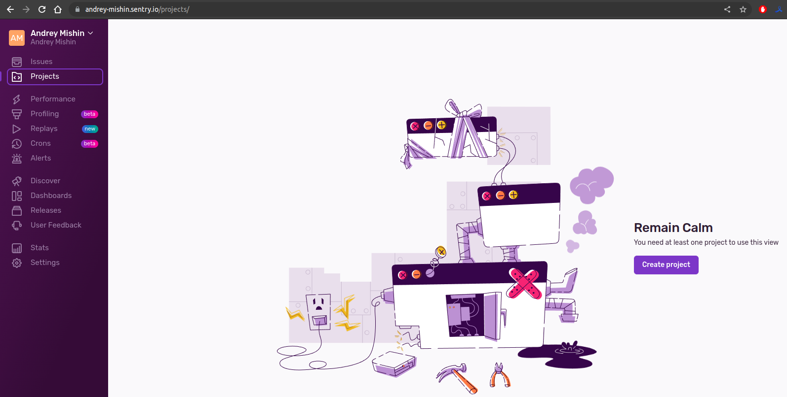
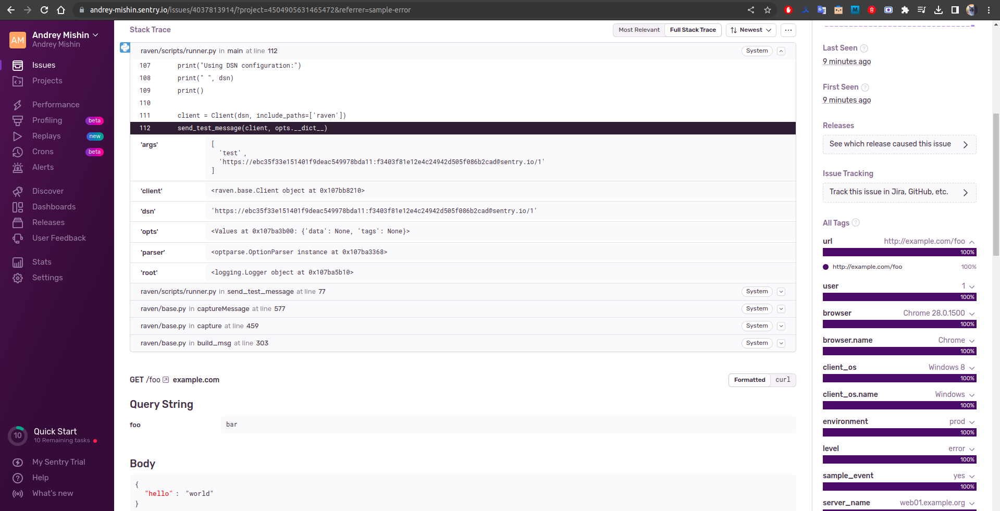
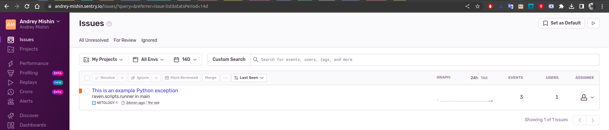
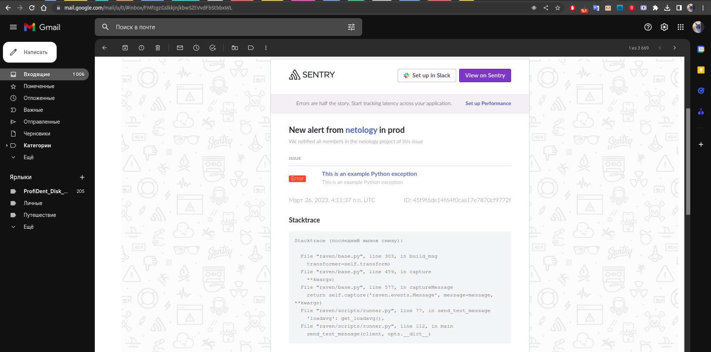

# Домашнее задание к занятию 16 «Платформа мониторинга Sentry»

## Задание 1

Зарегистрировался на [sentry.io](https://sentry.io) через свой **github**-аккаунт.  

[Скриншот](./files/sentry-init.png) меню `Projects`:

## Задание 2

1. Создайте python-проект и нажмите `Generate sample event` для генерации тестового события.
1. Изучите информацию, представленную в событии.
1. Перейдите в список событий проекта, выберите созданное вами и нажмите `Resolved`.
1. В качестве решения задание предоставьте скриншот `Stack trace` из этого события и список событий проекта после нажатия `Resolved`.

[Скриншот](./files/stack-trace.png) `Stack trace`:

  
[Скриншот](./files/issues.png) списка событий проекта после нажатия `Resolved`:
  

## Задание 3

1. Перейдите в создание правил алёртинга.
2. Выберите проект и создайте дефолтное правило алёртинга без настройки полей.
3. Снова сгенерируйте событие `Generate sample event`.
Если всё было выполнено правильно — через некоторое время вам на почту, привязанную к GitHub-аккаунту, придёт оповещение о произошедшем событии.
4. Если сообщение не пришло — проверьте настройки аккаунта Sentry (например, привязанную почту), что у вас не было 
`sample issue` до того, как вы его сгенерировали, и то, что правило алёртинга выставлено по дефолту (во всех полях all).
Также проверьте проект, в котором вы создаёте событие — возможно алёрт привязан к другому.
5. В качестве решения задания пришлите скриншот тела сообщения из оповещения на почте.
6. Дополнительно поэкспериментируйте с правилами алёртинга. Выбирайте разные условия отправки и создавайте sample events. 

[Скриншот](./files/alert.png) тела сообщения:

