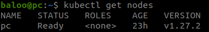
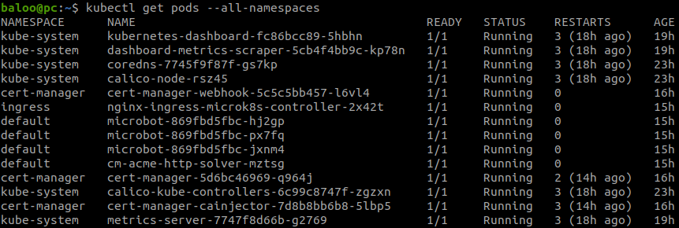
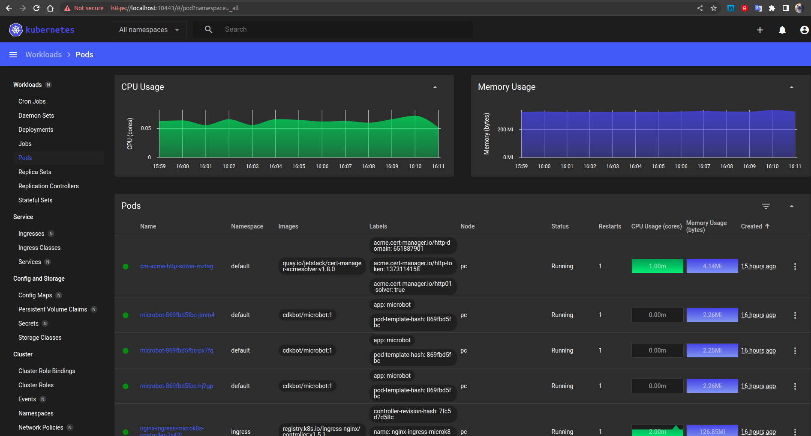

# Домашнее задание к занятию «Kubernetes. Причины появления. Команда kubectl»

Рабочая машина под управлением **Ubuntu 20.04 LTS**, `snap` имеется, поэтому устанавливать его нет необходимости.  
  
## Ход работы:

### 1.1 С помощью `snapd` установил `microk8s` и `kubectl`

```bash
baloo@pc:~$ sudo snap install microk8s --classic
microk8s (1.27/stable) v1.27.2 from Canonical✓ installed

baloo@pc:~$ sudo snap install kubectl --classic
kubectl 1.27.3 from Canonical✓ installed
```

**Добавил своего пользователя в группу `microk8s`**

```bash
sudo usermod -aG microk8s $USER
```

**Создаю директорию `.kube` в своей домашней директории**

```bash
baloo@pc:~$ mkdir ~/.kube
```

### 1.2 устанавливаю `dashboard`

```bash
baloo@pc:~$ microk8s enable dashboard
Infer repository core for addon dashboard
Enabling Kubernetes Dashboard
Infer repository core for addon metrics-server
Enabling Metrics-Server
serviceaccount/metrics-server created
clusterrole.rbac.authorization.k8s.io/system:aggregated-metrics-reader created
clusterrole.rbac.authorization.k8s.io/system:metrics-server created
rolebinding.rbac.authorization.k8s.io/metrics-server-auth-reader created
clusterrolebinding.rbac.authorization.k8s.io/metrics-server:system:auth-delegator created
clusterrolebinding.rbac.authorization.k8s.io/system:metrics-server created
service/metrics-server created
deployment.apps/metrics-server created
apiservice.apiregistration.k8s.io/v1beta1.metrics.k8s.io created
clusterrolebinding.rbac.authorization.k8s.io/microk8s-admin created
Metrics-Server is enabled
Applying manifest
serviceaccount/kubernetes-dashboard created
service/kubernetes-dashboard created
secret/kubernetes-dashboard-certs created
secret/kubernetes-dashboard-csrf created
secret/kubernetes-dashboard-key-holder created
configmap/kubernetes-dashboard-settings created
role.rbac.authorization.k8s.io/kubernetes-dashboard created
clusterrole.rbac.authorization.k8s.io/kubernetes-dashboard created
rolebinding.rbac.authorization.k8s.io/kubernetes-dashboard created
clusterrolebinding.rbac.authorization.k8s.io/kubernetes-dashboard created
deployment.apps/kubernetes-dashboard created
service/dashboard-metrics-scraper created
deployment.apps/dashboard-metrics-scraper created
secret/microk8s-dashboard-token created

If RBAC is not enabled access the dashboard using the token retrieved with:

microk8s kubectl describe secret -n kube-system microk8s-dashboard-token

Use this token in the https login UI of the kubernetes-dashboard service.

In an RBAC enabled setup (microk8s enable RBAC) you need to create a user with restricted
permissions as shown in:
https://github.com/kubernetes/dashboard/blob/master/docs/user/access-control/creating-sample-user.md
```

### 1.3 Для генерации сертификата для подключения к внешнему IP-адресу использую инструкцию [Microk8s cert-manager](https://microk8s.io/docs/addon-cert-manager)
  
**Включаю addon `cert-manager`**  

```bash
baloo@pc:~$ microk8s enable cert-manager
Infer repository core for addon cert-manager
Enable DNS addon
Infer repository core for addon dns
Addon core/dns is already enabled
Enabling cert-manager
namespace/cert-manager created
customresourcedefinition.apiextensions.k8s.io/certificaterequests.cert-manager.io created
customresourcedefinition.apiextensions.k8s.io/certificates.cert-manager.io created
customresourcedefinition.apiextensions.k8s.io/challenges.acme.cert-manager.io created
customresourcedefinition.apiextensions.k8s.io/clusterissuers.cert-manager.io created
customresourcedefinition.apiextensions.k8s.io/issuers.cert-manager.io created
customresourcedefinition.apiextensions.k8s.io/orders.acme.cert-manager.io created
serviceaccount/cert-manager-cainjector created
serviceaccount/cert-manager created
serviceaccount/cert-manager-webhook created
configmap/cert-manager-webhook created
clusterrole.rbac.authorization.k8s.io/cert-manager-cainjector created
clusterrole.rbac.authorization.k8s.io/cert-manager-controller-issuers created
clusterrole.rbac.authorization.k8s.io/cert-manager-controller-clusterissuers created
clusterrole.rbac.authorization.k8s.io/cert-manager-controller-certificates created
clusterrole.rbac.authorization.k8s.io/cert-manager-controller-orders created
clusterrole.rbac.authorization.k8s.io/cert-manager-controller-challenges created
clusterrole.rbac.authorization.k8s.io/cert-manager-controller-ingress-shim created
clusterrole.rbac.authorization.k8s.io/cert-manager-view created
clusterrole.rbac.authorization.k8s.io/cert-manager-edit created
clusterrole.rbac.authorization.k8s.io/cert-manager-controller-approve:cert-manager-io created
clusterrole.rbac.authorization.k8s.io/cert-manager-controller-certificatesigningrequests created
clusterrole.rbac.authorization.k8s.io/cert-manager-webhook:subjectaccessreviews created
clusterrolebinding.rbac.authorization.k8s.io/cert-manager-cainjector created
clusterrolebinding.rbac.authorization.k8s.io/cert-manager-controller-issuers created
clusterrolebinding.rbac.authorization.k8s.io/cert-manager-controller-clusterissuers created
clusterrolebinding.rbac.authorization.k8s.io/cert-manager-controller-certificates created
clusterrolebinding.rbac.authorization.k8s.io/cert-manager-controller-orders created
clusterrolebinding.rbac.authorization.k8s.io/cert-manager-controller-challenges created
clusterrolebinding.rbac.authorization.k8s.io/cert-manager-controller-ingress-shim created
clusterrolebinding.rbac.authorization.k8s.io/cert-manager-controller-approve:cert-manager-io created
clusterrolebinding.rbac.authorization.k8s.io/cert-manager-controller-certificatesigningrequests created
clusterrolebinding.rbac.authorization.k8s.io/cert-manager-webhook:subjectaccessreviews created
role.rbac.authorization.k8s.io/cert-manager-cainjector:leaderelection created
role.rbac.authorization.k8s.io/cert-manager:leaderelection created
role.rbac.authorization.k8s.io/cert-manager-webhook:dynamic-serving created
rolebinding.rbac.authorization.k8s.io/cert-manager-cainjector:leaderelection created
rolebinding.rbac.authorization.k8s.io/cert-manager:leaderelection created
rolebinding.rbac.authorization.k8s.io/cert-manager-webhook:dynamic-serving created
service/cert-manager created
service/cert-manager-webhook created
deployment.apps/cert-manager-cainjector created
deployment.apps/cert-manager created
deployment.apps/cert-manager-webhook created
mutatingwebhookconfiguration.admissionregistration.k8s.io/cert-manager-webhook created
validatingwebhookconfiguration.admissionregistration.k8s.io/cert-manager-webhook created
Waiting for cert-manager to be ready.
...ready
Enabled cert-manager

===========================

Cert-manager is installed. As a next step, try creating a ClusterIssuer
for Let's Encrypt by creating the following resource:

$ microk8s kubectl apply -f - <<EOF
---
apiVersion: cert-manager.io/v1
kind: ClusterIssuer
metadata:
  name: letsencrypt
spec:
  acme:
    # You must replace this email address with your own.
    # Let's Encrypt will use this to contact you about expiring
    # certificates, and issues related to your account.
    email: me@example.com
    server: https://acme-v02.api.letsencrypt.org/directory
    privateKeySecretRef:
      # Secret resource that will be used to store the account's private key.
      name: letsencrypt-account-key
    # Add a single challenge solver, HTTP01 using nginx
    solvers:
    - http01:
        ingress:
          class: public
EOF

Then, you can create an ingress to expose 'my-service:80' on 'https://my-service.example.com' with:

$ microk8s enable ingress
$ microk8s kubectl create ingress my-ingress     --annotation cert-manager.io/cluster-issuer=letsencrypt     --rule 'my-service.example.com/*=my-service:80,tls=my-service-tls'
```

**Включаю addon `ingress` и `dns`**

```bash
baloo@pc:~$ microk8s enable ingress dns
Infer repository core for addon ingress
Infer repository core for addon dns
WARNING: Do not enable or disable multiple addons in one command.
         This form of chained operations on addons will be DEPRECATED in the future.
         Please, enable one addon at a time: 'microk8s enable <addon>'
Enabling Ingress
ingressclass.networking.k8s.io/public created
ingressclass.networking.k8s.io/nginx created
namespace/ingress created
serviceaccount/nginx-ingress-microk8s-serviceaccount created
clusterrole.rbac.authorization.k8s.io/nginx-ingress-microk8s-clusterrole created
role.rbac.authorization.k8s.io/nginx-ingress-microk8s-role created
clusterrolebinding.rbac.authorization.k8s.io/nginx-ingress-microk8s created
rolebinding.rbac.authorization.k8s.io/nginx-ingress-microk8s created
configmap/nginx-load-balancer-microk8s-conf created
configmap/nginx-ingress-tcp-microk8s-conf created
configmap/nginx-ingress-udp-microk8s-conf created
daemonset.apps/nginx-ingress-microk8s-controller created
Ingress is enabled
Addon core/dns is already enabled
```

**Создаю `ClusterIssuer`**

```bash
baloo@pc:~$ microk8s kubectl apply -f - <<EOF
> apiVersion: cert-manager.io/v1
> kind: ClusterIssuer
> metadata:
>  name: lets-encrypt
> spec:
>  acme:
>    email: ******@gmail.com
>    server: https://acme-v02.api.letsencrypt.org/directory
>    privateKeySecretRef:
>      # Secret resource that will be used to store the account's private key.
>      name: lets-encrypt-priviate-key
>    # Add a single challenge solver, HTTP01 using nginx
>    solvers:
>    - http01:
>        ingress:
>          class: public
> EOF
clusterissuer.cert-manager.io/lets-encrypt created
```
  
**Проверяю, что кластер-иммитент создан корректно:**  

```bash
baloo@pc:~$ microk8s kubectl get clusterissuer -o wide
NAME           READY   STATUS                                                 AGE
lets-encrypt   True    The ACME account was registered with the ACME server   2m4s
```
  
**Развёртывание сервиса `microbot`**  

```bash
baloo@pc:~$ microk8s kubectl create deploy --image cdkbot/microbot:1 --replicas 3 microbot
deployment.apps/microbot created
```

```bash
baloo@pc:~$ microk8s kubectl expose deploy microbot --port 80 --type ClusterIP
service/microbot exposed
```
  
**Проверка работы сервиса `microbot`**  

```bash
baloo@pc:~$ microk8s kubectl get pod,svc
NAME                            READY   STATUS    RESTARTS   AGE
pod/microbot-869fbd5fbc-hj2gp   1/1     Running   0          6m40s
pod/microbot-869fbd5fbc-px7fq   1/1     Running   0          6m39s
pod/microbot-869fbd5fbc-jxnm4   1/1     Running   0          6m39s

NAME                 TYPE        CLUSTER-IP       EXTERNAL-IP   PORT(S)   AGE
service/kubernetes   ClusterIP   10.152.183.1     <none>        443/TCP   7h37m
service/microbot     ClusterIP   10.152.183.238   <none>        80/TCP    2m45s
```

**Настройка входа**

```bash
baloo@pc:~$ microk8s kubectl apply -f - <<EOF
> apiVersion: networking.k8s.io/v1
> kind: Ingress
> metadata:
>  name: microbot-ingress
>  annotations:
>    cert-manager.io/cluster-issuer: lets-encrypt
> spec:
>  tls:
>  - hosts:
>    - ******.name
>    secretName: microbot-ingress-tls
>  rules:
>  - host: ******.name
>    http:
>      paths:
>      - backend:
>          service:
>            name: microbot
>            port:
>              number: 80
>        path: /
>        pathType: Exact
> EOF
ingress.networking.k8s.io/microbot-ingress created
```
  
### 2.1 Установка `kubectl` была выполнена в п. 1.1

### 2.2 Настройка локального подключение к кластеру по инструкции [Working with kubectl](https://microk8s.io/docs/working-with-kubectl)  

```bash
baloo@pc:~$ mkdir .kube
baloo@pc:~$ cd .kube/
baloo@pc:~/.kube$ microk8s config > config

baloo@pc:~/.kube$ ll
total 12
drwxrwxr-x  2 baloo baloo 4096 июл 23 13:47 ./
drwxr-xr-x 48 baloo baloo 4096 июл 23 13:47 ../
-rw-rw-r--  1 baloo baloo 1874 июл 23 13:47 config
```

```bash
baloo@pc:~/.kube$ kubectl get nodes
NAME   STATUS   ROLES    AGE   VERSION
pc     Ready    <none>   21h   v1.27.2
```

### 2.3 Подключение к дашборду с помощью `port-forwarding`

```bash
baloo@pc:~$ microk8s kubectl port-forward -n kube-system service/kubernetes-dashboard 10443:443
Forwarding from 127.0.0.1:10443 -> 8443
Forwarding from [::1]:10443 -> 8443
```
  
## ИТОГО:
  
[Скриншот](./files/nodes.png) `kubectl get nodes`:  

  
[Скриншот](./files/pods.png) `kubectl get pods`: 

  
[Скриншот](./files/dashboard.png) `Dashboard`:  

  
