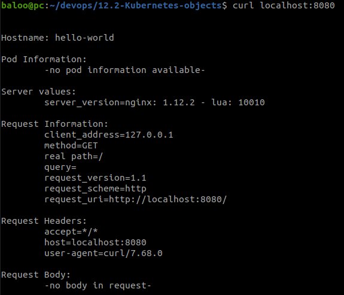
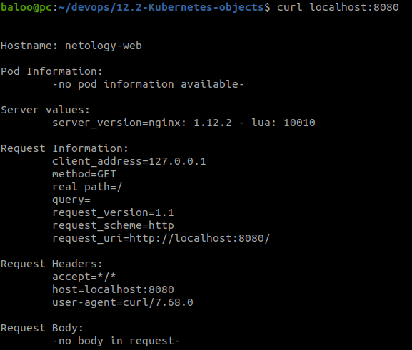
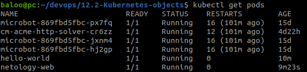

# Домашнее задание к занятию «Базовые объекты K8S»

### Цель задания

В тестовой среде для работы с Kubernetes, установленной в предыдущем ДЗ, необходимо развернуть Pod с приложением и подключиться к нему со своего локального компьютера. 

------

### Чеклист готовности к домашнему заданию

1. Установленное k8s-решение (например, MicroK8S).
2. Установленный локальный kubectl.
3. Редактор YAML-файлов с подключенным Git-репозиторием.

------

## Подготовка:

**Установил `VS Code`.  
`Microk8s` и `kubectl` установлены с прошлого ДЗ**

------

### Задание 1. Создать Pod с именем hello-world

1. Создать манифест (yaml-конфигурацию) Pod.
2. Использовать image - gcr.io/kubernetes-e2e-test-images/echoserver:2.2.
3. Подключиться локально к Pod с помощью `kubectl port-forward` и вывести значение (curl или в браузере).

------

## Ход работы:
  
### 1.1 Создал манифест *Pod* с использованием указанного *image*.
```yaml
apiVersion: v1
kind: Pod
metadata:
  name: hello-world
spec:
  containers:
    - name: echoserver
      image: gcr.io/kubernetes-e2e-test-images/echoserver:2.2
      resources:
        requests:
          memory: "64Mi"
          cpu: "250m"
        limits:
          memory: "128Mi"
          cpu: "500m"
      ports:
        - containerPort: 80
```
  
### 1.2 Скачал нужный *image*
```bash
docker pull gcr.io/kubernetes-e2e-test-images/echoserver:2.2
```
  
### 1.3 Поднял нужный *Pod* и подключился к нему с помощью `kubectl port-forward`
```bash
baloo@pc:~/devops/12.2-Kubernetes-objects$ kubectl apply -f ./pod-hello-world.yaml 
pod/hello-world created
```
  
```bash
baloo@pc:~/devops/12.2-Kubernetes-objects$ kubectl port-forward -n default pods/hello-world 8080:8080
Forwarding from 127.0.0.1:8080 -> 8080
Forwarding from [::1]:8080 -> 8080
Handling connection for 8080
```
  
[Скриншот](./files/hello-world.png):  
  


------

### Задание 2. Создать Service и подключить его к Pod

1. Создать Pod с именем netology-web.
2. Использовать image — gcr.io/kubernetes-e2e-test-images/echoserver:2.2.
3. Создать Service с именем netology-svc и подключить к netology-web.
4. Подключиться локально к Service с помощью `kubectl port-forward` и вывести значение (curl или в браузере).

------


## Ход работы:
  
### 2.1 Создал манифест с *Pod* и *Service*.
```yaml
apiVersion: v1
kind: Pod
metadata:
  name: netology-web
  labels:
    app: echoserver
spec:
  containers:
    - name: echoserver
      image: gcr.io/kubernetes-e2e-test-images/echoserver:2.2
      resources:
        requests:
          memory: "64Mi"
          cpu: "250m"
        limits:
          memory: "128Mi"
          cpu: "500m"
      ports:
        - containerPort: 80
---
apiVersion: v1
kind: Service
metadata:
  name: netology-svc
spec:
  selector:
    app: echoserver
  ports:
    - protocol: TCP
      port: 80
      targetPort: 8080
```

### 2.2 Поднял нужные *Pod* и *Service*. Подключился к *Service* с помощью `kubectl port-forward`

```bash
baloo@pc:~/devops/12.2-Kubernetes-objects$ kubectl apply -f ./netology-web.yaml 
pod/netology-web created
service/netology-svc created
```
  
```bash
baloo@pc:~/devops/12.2-Kubernetes-objects$ kubectl port-forward services/netology-svc 8080:80
Forwarding from 127.0.0.1:8080 -> 8080
Forwarding from [::1]:8080 -> 8080
Handling connection for 8080
```
  
[Скриншот](./files/netology-web.png)  

  

-----

## Результаты
  
**1. [Скриншот](./files/get-pods.png) вывода команд `kubectl get pods`:**  
  
  
**2. [Файл манифеста Pod hello-world](./files/pod-hello-world.yaml)**  
  
**3. [Файл манифеста Pod и Service netology-web](./files/netology-web.yaml)**  
  
-----


