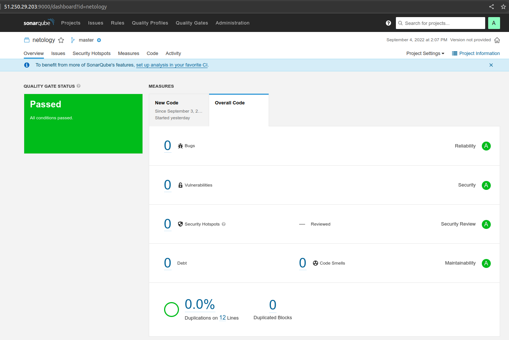

# Выпонение домашнего задания к занятию "09.03 CI\CD"

## Подготовка к выполнению

1. Создал 2 VM в **cloud.yandex** с помощью **terraform** с параметрами согласно заданию.
2. Скорректировал содержимое директорий *inventory, group_vars, files, example и templates* для **ansible**. Подложил свой *id_rsa.pub*.
3. Запустил *playbook*. Всё завершилось успешно.
```
PLAY RECAP *********************************************************************************************
nexus-01                   : ok=17   changed=15   unreachable=0    failed=0    skipped=2    rescued=0    ignored=0
sonar-01                   : ok=35   changed=27   unreachable=0    failed=0    skipped=0    rescued=0    ignored=0
```
4. **SonarQube** и **Nexus** запустились, пароли поменял.

## Знакомство с SonarQube

### Основная часть

- Делаем скриншот успешного прохождения анализа


## Знакомство с Nexus

### Основная часть

- В ответе присылаем файл **[maven-metadata.xml](./files/maven-metadata.xml "Файл maven-metadata.xml")** для этого артефакта  
Содержимое *maven-metadata.xml*:
```xml
<?xml version="1.0" encoding="UTF-8"?>
<metadata modelVersion="1.1.0">
  <groupId>netology</groupId>
  <artifactId>java</artifactId>
  <versioning>
    <latest>8_282</latest>
    <release>8_282</release>
    <versions>
      <version>8_102</version>
      <version>8_282</version>
    </versions>
    <lastUpdated>20220904115133</lastUpdated>
  </versioning>
</metadata>
```

### Знакомство с Maven

### Подготовка к выполнению

- Выполнил всё согласно описанию по подготовке
- Для работы Maven пришлось дополнительно установить Java

### Основная часть

- В ответе присылаем исправленный файл **[pom.xml](./files/pom.xml "Файл pom.xml")**  
Содержимое *pom.xml*:
```xml
<project xmlns="http://maven.apache.org/POM/4.0.0" xmlns:xsi="http://www.w3.org/2001/XMLSchema-instance"
  xsi:schemaLocation="http://maven.apache.org/POM/4.0.0 http://maven.apache.org/xsd/maven-4.0.0.xsd">
  <modelVersion>4.0.0</modelVersion>
 
  <groupId>com.netology.app</groupId>
  <artifactId>simple-app</artifactId>
  <version>1.0-SNAPSHOT</version>
   <repositories>
    <repository>
      <id>my-repo</id>
      <name>maven-public</name>
      <url>http://84.201.165.216:8081/repository/maven-public/</url>
    </repository>
  </repositories>
  <dependencies>
     <dependency>
      <groupId>netology</groupId>
      <artifactId>java</artifactId>
      <version>8_282</version>
      <classifier>distrib</classifier>
      <type>tar.gz</type>
    </dependency>
  </dependencies>
</project>
```
---
